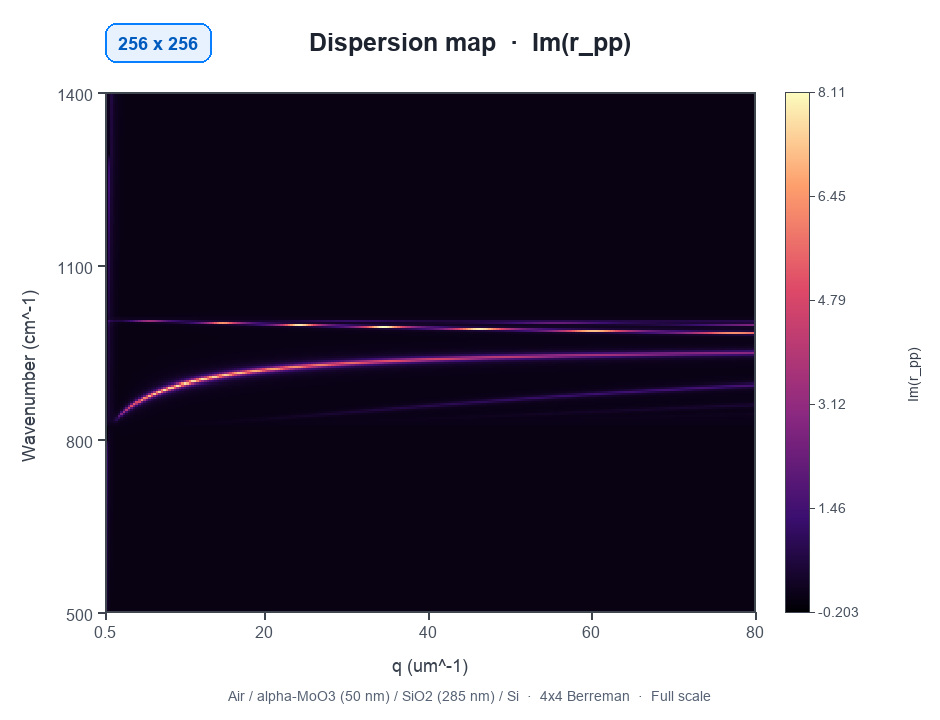
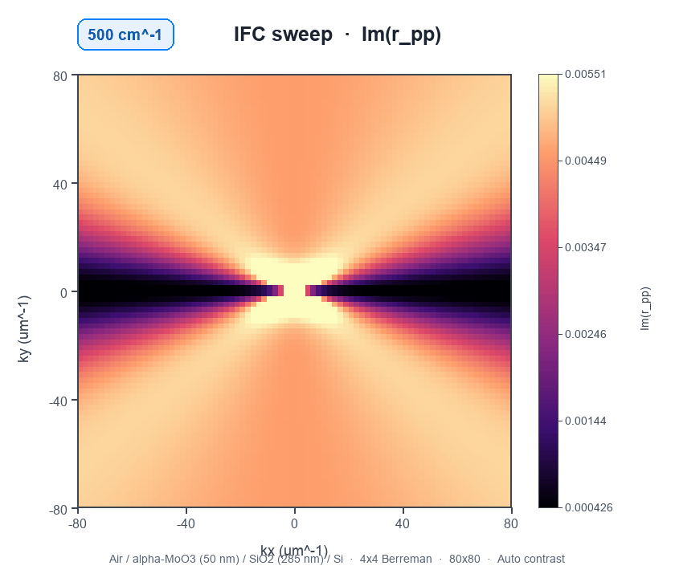
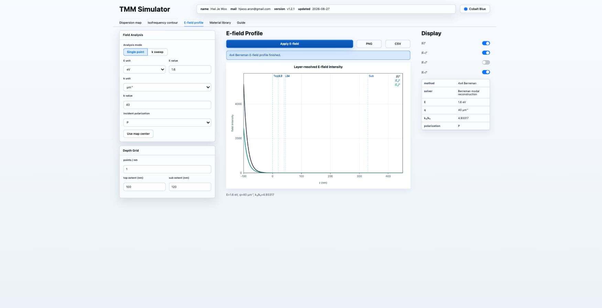
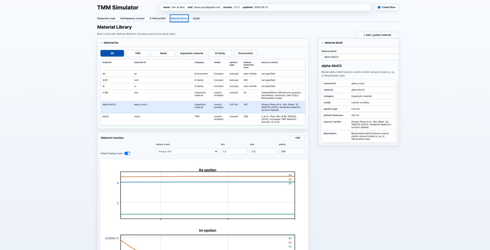

# TMM Simulator

A desktop research tool for optical multilayers, anisotropic polaritons, and near-field response maps.

[Download the latest release](https://github.com/kirudin/TMM-simulator-public/releases/latest) · [Read the user manual](USER_MANUAL.md) · [Report an issue](https://github.com/kirudin/TMM-simulator-public/issues)

The example above uses Air / alpha-MoO3 (50 nm) / SiO2 (285 nm) / Si with a 4x4 Berreman calculation on a 256 x 256 grid from 500 to 1400 cm⁻¹ and 0.5 to 80 µm⁻¹.

**Video:** [Watch the one-minute interface walkthrough](assets/tmm-simulator-interface-walkthrough.mp4) (MP4, no narration or captions). It covers the dispersion workflow, a high-resolution recalculation, IFC analysis, E-field profiles, and the Material Library.

## Explore multilayer optics without scripting

TMM Simulator packages common multilayer workflows into one local desktop interface.

| Workspace | What it provides |
| --- | --- |
| Dispersion map | Energy-momentum reflection maps with selectable units, observables, and export channels |
| Isofrequency contour | Single-energy and sweep-mode kx-ky reflection-response maps |
| E-field profile | Layer-resolved driven field intensity at one momentum or across a momentum sweep |
| Material library | Built-in and user-defined scalar, uniaxial, and full 3x3 dielectric tensors |
| s-SNOM correction | Optional edge-fringe coordinate conversion with invalid regions kept masked |
| Export | Publication-ready PNG output and metadata-preserving CSV/ZIP data export |

## Watch the IFC evolve with energy

This animation contains 10 unique 80 x 80 IFC calculations from 500 to 1400 cm⁻¹. Each frame uses the same Air / alpha-MoO3 (50 nm) / SiO2 (285 nm) / Si stack, the 4x4 Berreman solver, a ±80 µm⁻¹ kx-ky range, and Auto contrast.

## Interface tour

| Layer-resolved E-field profile | Material tensor inspection |
| --- | --- |
|  |  |

## Download

Open [Releases](https://github.com/kirudin/TMM-simulator-public/releases/latest) and download the ZIP for your computer.

- macOS Apple Silicon: `TMM-Simulator-Darwin-arm64-v...zip`
- Windows 64-bit: `TMM-Simulator-Windows-AMD64-v...zip`

The macOS and Windows packages are built separately. Their version numbers should match the Release tag.

## Quick start

### macOS

1. Download and unzip the macOS package.
2. Open the extracted folder.
3. Double-click `Launch TMM Simulator.command`.
4. Keep the launcher window open while using the app.

If macOS blocks the launcher, right-click it, choose **Open**, and confirm. If needed, allow it under **System Settings -> Privacy & Security**.

### Windows

1. Download and unzip the Windows package.
2. Open the extracted folder.
3. Double-click the TMM Simulator executable.

If Windows SmartScreen appears, choose **More info** and then **Run anyway**.

## Supported inputs and controls

- isotropic, uniaxial, and full 3x3 dielectric tensors;
- arbitrary finite layer stacks between semi-infinite top and substrate media;
- eV, wavelength, wavenumber, absolute momentum, and normalized momentum units;
- 2x2 isotropic and 4x4 Berreman calculation paths;
- co- and cross-polarized reflection channels;
- custom observables assembled from complex reflection coefficients;
- user material import from CSV, TXT, TSV, DAT, and XLSX tables;
- reusable layer-stack and calculation-grid presets;
- ten optimized UI color themes.

## Scientific scope

TMM Simulator calculates driven optical reflection and field responses for layered media. Bright features in a reflection map are candidate optical structures, not automatic proof of a polariton eigenmode.

For quantitative interpretation, retain the material source, full layer stack, tensor rotation, solver method, grid, units, warnings, and numerical-convergence checks. The IFC workspace is an in-plane kx-ky reflection diagnostic; it is not a bulk kx-kz dispersion surface. The E-field workspace reconstructs a driven scattering response rather than a normalized eigenmode.

## Local data and update checks

- Calculations run locally on your computer.
- User materials and stack presets are stored in the user's local app-data folder and are not replaced by a normal application update.
- The optional **Check for updates** action contacts this GitHub repository only when requested.
- The app does not automatically install an update.

## Documentation and support

- Start with the [User Manual](USER_MANUAL.md) for workflow details and interpretation guidance.
- Use [GitHub Issues](https://github.com/kirudin/TMM-simulator-public/issues) for reproducible problems and feature requests.
- Include the application version, operating system, complete stack, grid, solver method, and exported metadata when reporting a numerical issue.

## Distribution notice

This public repository distributes packaged executables and user documentation. It does not include the private source code, numerical kernels, material-library implementation, or research-development history.

## Maintainer

Hwi Je Woo 
ARON Lab 
hjwoo.aron@gmail.com
